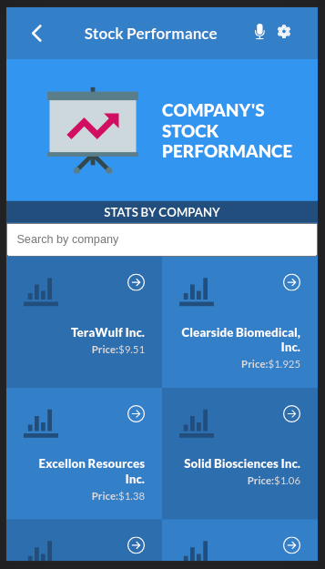
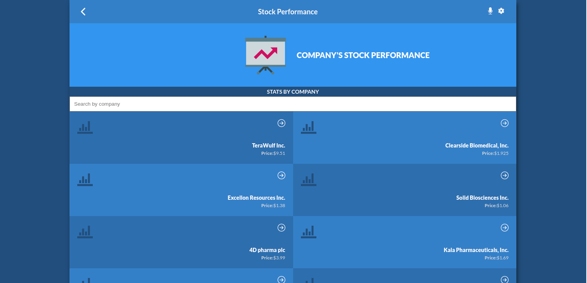

# Stock Performace App

>Stock performance is a web application to check out performance by company to see which one performs the best, based on an external API provided by Financial Modeling Prep. Built with Ract, Redux, and SCSS.

# Screenshots:

## Mobile version:

## Desktop version:

# Video demo:

https://loom.com/share/0319c1098c374d319af0fcded28111e6

## Built With

### - Major languages:
  - JavaScript
  - HTML
  - CSS

### - Frameworks used:
  - React

### - Technologies used:
  - npm
  - Webpack
  - Redux

## Learning objectives

- Use React documentation.
- Use React components.
- Use React props.
- Use React Router.
- Connect React and Redux.
- Handle events in a React app.
- Write integration tests with a React testing library.
- Use styles in a React app.
- Use React life cycle methods.
- Apply React best practices and language style guides in code.
- Use store, actions and reducers in React.

## Live Demo

[Stock Performace App Live Demo Link](https://andres-condezo.github.io/stock-performance/)

## Getting Started

- In order to see the app in your browser you must click on the link "Live Demo"

- To get a local copy up and running follow these simple example steps:

### Prerequisites
  - Node
  - npm

### Setup

- Clone the repository and install the dependencies:

$ `git clone https://github.com/andres-condezo/stock-performance.git`

$ `cd stock-performance`

$ `npm Install`

---

## Available Scripts

In the project directory, you can run:

$ `npm start`

Runs the app in the development mode.\
Open [http://localhost:3000](http://localhost:3000) to view it in your browser.

The page will reload when you make changes.\
You may also see any lint errors in the console.

$ `npm test`

Launches the test runner in the interactive watch mode.\

$ `npm run build`

Builds the app for production to the `build` folder.\
It correctly bundles React in production mode and optimizes the build for the best performance.

The build is minified and the filenames include the hashes.\
Your app is ready to be deployed!

$ `npm run eject`

**Note: this is a one-way operation. Once you `eject`, you can't go back!**

If you aren't satisfied with the build tool and configuration choices, you can `eject` at any time. This command will remove the single build dependency from your project.

Instead, it will copy all the configuration files and the transitive dependencies (webpack, Babel, ESLint, etc) right into your project so you have full control over them. All of the commands except `eject` will still work, but they will point to the copied scripts so you can tweak them. At this point you're on your own.

## Authors

👤 **Andrés Condezo Monge**

- GitHub: [@andres-condezo](https://github.com/andres-condezo)
- Twitter: [@andres_condezo](https://twitter.com/andres_condezo)
- LinkedIn: [andres-condezo](https://linkedin.com/in/andres-condezo)

## 🤝 Contributing

Contributions, issues, and feature requests are welcome!

Feel free to check the [issues page](../../issues/).

## Show your support

Give a ⭐️ if you like this project!

## Acknowledgments

- This project was bootstrapped with [Create React App](https://github.com/facebook/create-react-app).
- Data provided by Financial Modeling Prep API.
- Original design idea by Nelson Sakwa on Behance.
- Icons from https://react-icons.github.io/react-icons/.
- Fonts from https://fonts.google.com/.

## 📝 License

This project is [MIT](./MIT.md) licensed.
